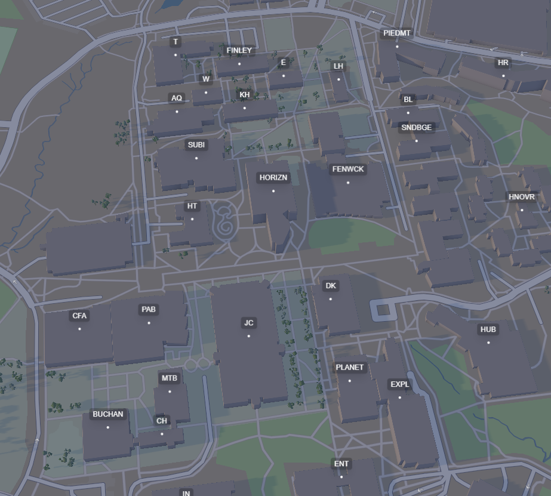

## Ghost

Ghost is an interactive campus map tool for GMU students. It helps find empty classrooms across campus during specific times, providing a quiet space to study or focus without distractions.



## Features

-   Visualizes GMU campus buildings using Mapbox.
-   Find empty rooms in specific buildings based on current class schedules.
-   Filter room availability by building, day, and time.
-   View building details and available rooms

## Architecture

#### Frontend (`/frontend`)

-   **Framework**: [Next.js](https://nextjs.org/) (React)
-   **Language**: TypeScript
-   **Map Library**: [React Map GL](https://visgl.github.io/react-map-gl/) (Mapbox)
-   **Styling**: Tailwind CSS

#### Backend (`/go`)

-   **Language**: Go
-   **Framework**: [Gin](https://gin-gonic.com/)
-   **Database**: Google Cloud Firestore
-   **Scraper**: A custom Go scraper that fetches course schedule data from the GMU Student Registration system.

## Project Structure

```
 frontend/
    app/            # pages and layouts
    components/     # UI components
    lib/            # Utility functions
    types/          # TypeScript definitions

 go/
    cmd/
       main.go     # API server entry point
       scraper/    # Scraper
    internal/
       api/        # API route handlers
       firestore/  # Database initialization and client
       types/      # Go struct definitions
    go.mod
```

## Getting Started

#### Prerequisites

-   Node.js (v18+)
-   Go (v1.20+)
-   Mapbox Access Token (free @ [mapbox.com](https://mapbox.com))
-   Google Cloud Project with Firestore enabled

#### 1. Frontend Setup

1.  Navigate to the frontend directory:
    ```bash
    cd frontend
    ```
2.  Install dependencies:
    ```bash
    npm install
    # or
    yarn install
    ```
3.  Create a `.env.local` file in the `frontend` directory:
    ```env
    NEXT_PUBLIC_MAPBOX_TOKEN=pk.eyJ1... (your Mapbox public token)
    NEXT_PUBLIC_BACKEND_URL=http://localhost:8080 (optional, defaults to this)
    ```
4.  Run the development server:
    ```bash
    npm run dev
    ```

#### 2. Backend Setup

1.  Navigate to the go directory:
    ```bash
    cd go
    ```
2.  Install Go dependencies:
    ```bash
    go mod download
    ```
3.  Create a `.env` file in the `go` directory:

    ```env
    GOOGLE_PROJECT_ID=your-project-id
    FRONTEND_URL=http://localhost:3000
    DEV=true
    PORT=5000
    ```

    _NOTE: Ensure you have your Google Cloud credentials set up (e.g., `GOOGLE_APPLICATION_CREDENTIALS` env variable pointing to your service account key)._

4.  Run the API server:
    ```bash
    go run cmd/main.go
    ```
    The server will run on port `5000` (whatever you set it to in .env).

#### 3. Running the Scraper

To populate the Firestore database with Mason course data:

1.  Navigate to the go directory:
    ```bash
    cd go
    ```
2.  Run the scraper:
    ```bash
    go run cmd/scraper/scraper.go
    ```
    _IMPORTANT: The scraper is configured for specific terms (e.g., "202610") in the code. You may need to update the `Term` constant in `cmd/scraper/scraper.go`._

## API Endpoints

-   `GET /health`: Health check endpoint.
-   `GET /api/buildings`: Returns a list of supported buildings with their coordinates.
-   `GET /api/rooms`: Fetch room schedules.
    -   Query Params:
        -   `building`: Building code (e.g., `HORIZN`)
        -   `day`: (Optional) Day of the week
        -   `time`: (Optional) Time of day

## Contributing to this project

1.  Fork the repository.
2.  Create a feature branch (`git checkout -b feature/amazing-feature`).
3.  Commit your changes (`git commit -m 'Add some amazing feature'`).
4.  Push to the branch (`git push origin feature/amazing-feature`).
5.  Open a Pull Request.
